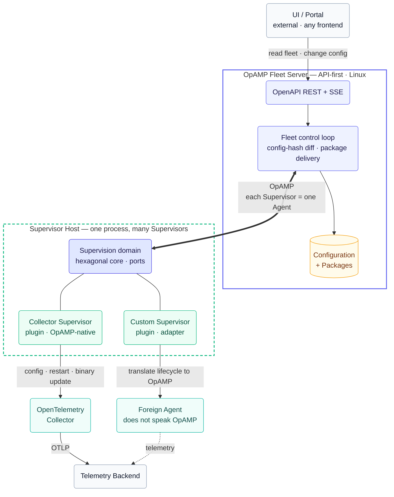

# OpAMP Fleet

[](https://github.com/mbrigl/opamp-fleet/actions/workflows/docs-check.yml)

**OpAMP Fleet** is a Rust implementation of OpenTelemetry [OpAMP](https://opentelemetry.io/docs/specs/opamp/)-based
fleet management: an API-first **Server** that manages a fleet over the protocol and exposes an
OpenAPI-described REST API for any UI or portal, and a **Supervisor Host** that runs many supervisors at
once — for OpenTelemetry Collectors and, through plugins, for foreign agents that do not speak OpAMP. The work is driven by a written
**specification** ([`docs/SPECIFICATION.md`](docs/SPECIFICATION.md)) and **Architecture Decision
Records** ([`docs/adr/`](docs/adr/)), so intent and the reasoning behind every structural choice stay
explicit and reviewable.

> For agent instructions, see [`AGENTS.md`](AGENTS.md) — the single source of truth for all coding agents.

## Overview

A telemetry fleet is a heap of agents on a heap of machines, each configured by a local file. That
works for one agent and breaks down for a fleet: changing what a hundred agents do means reaching a
hundred machines, and nobody can say with certainty what each one is *actually* running. Configuration
drifts, rollouts are ad-hoc, and a bad configuration shows up as missing telemetry rather than as a
report.

[OpAMP](https://opentelemetry.io/docs/specs/opamp/) — the Open Agent Management Protocol — closes that
loop: an agent accepts configuration over the protocol and reports back what it applied and how it is
doing. **OpAMP Fleet** is a Rust implementation of both ends, built for a *heterogeneous* fleet —
OpenTelemetry Collectors **and** agents that were never built to speak OpAMP:

- **Server** — an API-first control plane (Linux). It holds the configuration the fleet should run,
  tracks what each agent reports back, and only reconfigures an agent whose configuration actually
  differs. Its contract is an **OpenAPI-described REST API**, so any UI or portal can read the fleet's
  state and change what it runs; the Server ships only a rudimentary UI of its own and is built to be
  integrated into an existing portal.
- **Supervisor Host** — one client process that runs **many supervisors at once**, installed as a native
  operating-system service on Linux, macOS, and Windows and able to update its own binary in place. Each
  supervisor manages one agent, applies the configuration it is sent, and reports its health and
  effective configuration back. A Collector supervisor manages an OpenTelemetry Collector natively; a
  **custom supervisor** manages a **foreign agent** that does not speak OpAMP by translating its
  lifecycle into the protocol.
- **Plugins over a hexagonal core** — supervisors are plugins behind stable ports. Bringing a new kind
  of agent under management means writing a plugin, not changing the core, so the same control loop
  reaches agents OpAMP was never designed for.

The goal is one place — reachable by any UI — to decide what every agent in the fleet runs and to see
what each one is really running, whether or not it speaks OpAMP. The full problem statement, goals,
vocabulary, and non-goals live in the **specification** ([`docs/SPECIFICATION.md`](docs/SPECIFICATION.md));
the reasoning behind each structural choice lives in the ADRs ([`docs/adr/`](docs/adr/)).

## Architecture

The picture keeps the shape of the [OpAMP reference architecture](https://opentelemetry.io/docs/specs/opamp/)
— a supervisor owning a Collector, exchanging OpAMP with a backend — and extends it with what makes
OpAMP Fleet different: an **API-first Server** whose contract is an OpenAPI REST API, a single
**Supervisor Host** that runs **many** Supervisors as plugins behind a hexagonal core, and a **Custom
Supervisor** that brings a **non-OpAMP Foreign Agent** into the same control loop.



On the wire the Server sees only **Agents**; whether an Agent is an OpAMP-native Collector Supervisor
or a Custom Supervisor fronting a Foreign Agent is invisible to it. Adding a new kind of managed agent
means writing another plugin against the same ports — the core does not change. The terms used here
(Server, Supervisor Host, Collector/Custom Supervisor, Foreign Agent, Plugin, Port, Selector, Package,
…) are defined in [`docs/SPECIFICATION.md`](docs/SPECIFICATION.md).

## Prerequisites

- [VS Code](https://code.visualstudio.com/) with the
  [Dev Containers](https://marketplace.visualstudio.com/items?itemName=ms-vscode-remote.remote-containers)
  extension — or any DevContainer-compatible IDE
- Docker / Podman (rootless) available on the host

## Getting Started

1. Open the repository in VS Code and choose **Reopen in Container** — the Dev Container and
   preconfigured agent extensions build automatically.
2. Authenticate your coding agent inside the container (for Claude Code: `claude login`).
3. Start working with the agent — drive the work from the specification and the ADRs.

## Build, Test & Run

The toolchain is **Rust stable**, provided by the Dev Container ([ADR-0003](docs/adr/0003-rust-toolchain-and-workspace.md));
the code is one Cargo workspace with three crates — `opamp` (shared library), `server`, and
`supervisor` (the Supervisor Host). This section is the single source for build/test/run commands —
both humans and agents rely on it (AGENTS.md links here).

- **Build:** `cargo build --workspace`
- **Test:** `cargo test --workspace`
- **Format check:** `cargo fmt --all --check`
- **Lint:** `cargo clippy --workspace --all-targets -- -D warnings`
- **Run the Server:** `cargo run -p server` (OpAMP endpoint + UI on `http://localhost:4320`)
- **Run the Supervisor Host:** `cargo run -p supervisor` (foreground; a bare invocation defaults to `run`)

In VS Code you can also use the **Run Server**, **Run Supervisor Host**, or the compound
**Server + Supervisor Host** launch configurations (`.vscode/launch.json`).

The Supervisor Host is a subcommand CLI ([ADR-0006](docs/adr/0006-supervisor-host-os-service-and-cli.md))
and can install and manage itself as a native OS service (systemd / launchd / Windows SCM) — run
`supervisor-host --help`. A system-level install needs root/Administrator; add `--user` for a
per-user service:

```sh
supervisor-host service install     # register as a service (captures the current OPAMP_* config)
supervisor-host service start        # start | stop | status | uninstall
```

An installed Supervisor Host can replace its own binary in place
([ADR-0007](docs/adr/0007-in-place-self-update-with-rollback.md)): versions are kept side by side and
an atomic `current` pointer is switched, with a health-gated automatic rollback. Apply a new binary
with `supervisor-host update --new-binary <path> [--hash <sha256>]`.

## Usage

The first version closes the OpAMP control loop for one Agent: start the Server, start the
Supervisor Host, then distribute a configuration and watch the Agent apply it.

1. **Start the Server** (holds fleet state in memory, serves the OpAMP endpoint and the UI):

   ```sh
   cargo run -p server
   ```

2. **Start the Supervisor Host** (connects and reports on an interval; it generates and persists an
   Instance UID under `./supervisor-state/`):

   ```sh
   cargo run -p supervisor
   ```

3. **Open the UI** at <http://localhost:4320> — the Agent appears with its Instance UID, health, and
   sequence number.

4. **Distribute a configuration** — paste it into the UI and click *Distribute to fleet*, or via the
   API directly:

   ```sh
   curl -X PUT --data $'receivers:\n  otlp: {}' http://localhost:4320/api/config
   ```

   Within one poll the Agent reports `remote_config_status: APPLIED` with the matching config hash,
   and its effective configuration updates in the UI. An unchanged configuration is never re-sent
   (the config-hash gate). Read the fleet as JSON any time:

   ```sh
   curl http://localhost:4320/api/agents
   ```

Configurable via environment: `OPAMP_PORT` (Server), and `OPAMP_SERVER_URL`, `OPAMP_STATE_DIR`,
`OPAMP_POLL_SECONDS` (Supervisor Host).

## Project Layout

```
README.md             # overview & setup for humans
AGENTS.md             # single source of truth for coding agents
docs/SPECIFICATION.md # the specification: problem, goals, vocabulary
docs/adr/             # Architecture Decision Records (+ template)
Cargo.toml            # Cargo workspace (ADR-0003): shared dependency versions
rust-toolchain.toml   # pinned Rust toolchain (stable + rustfmt + clippy)
crates/opamp/         # shared library: OpAMP wire contract + domain helpers
crates/server/        # the Server binary (API-first control plane)
crates/supervisor/    # the Supervisor Host binary (runs many Supervisors)
.devcontainer/        # Dev Container definition (base image + Features)
.vscode/              # shared editor settings
.claude/CLAUDE.md     # pointer for Claude Code to read AGENTS.md
.claude/settings.json # Claude Code permissions: prompt before git/gh writes
```

## Dev Container

The environment is defined entirely in [`.devcontainer/devcontainer.json`](.devcontainer/devcontainer.json):
it starts from a prebuilt base image and layers Dev Container Features and VS Code extensions on top —
no Dockerfile or Compose file required. Customise the environment by adding Features, switching the
base image, or adding extensions.

### Host container management

The Dev Container deliberately has **no access to the host Docker daemon** — the socket is not mounted
([ADR-0002](docs/adr/0002-dev-container-runtime.md)). To manage the host's containers from VS
Code, run the **Container Tools** extension (`ms-azuretools.vscode-containers`) on the **host** side:
install it in your host VS Code. [`.vscode/settings.json`](.vscode/settings.json) already pins it to
run locally via `remote.extensionKind`, so it keeps talking to the host engine even when this folder
is reopened in the container.

## Coding Agents

This Dev Container preinstalls the **Claude Code** and **Mistral Vibe** VS Code extensions (see
[`.devcontainer/devcontainer.json`](.devcontainer/devcontainer.json)); other agents (OpenAI Codex,
Cursor, OpenCode, GitHub Copilot) work too once you add them. Authenticate your agent inside the
container (for Claude Code: `claude login`).

The rules every agent follows live in [`AGENTS.md`](AGENTS.md); how each agent is wired to read them
is recorded in [ADR-0001](docs/adr/0001-agent-governance-model.md).

## Contributing

See [`CONTRIBUTING.md`](CONTRIBUTING.md) for the workflow (specification- and ADR-driven, small
reviewable changes) and [`CODE_OF_CONDUCT.md`](CODE_OF_CONDUCT.md) for the community standards we
expect of everyone taking part. Security issues: please follow [`SECURITY.md`](SECURITY.md) instead
of opening a public issue.

## License

Released under the Apache License 2.0 — see [`LICENSE`](LICENSE) and [`NOTICE`](NOTICE).
