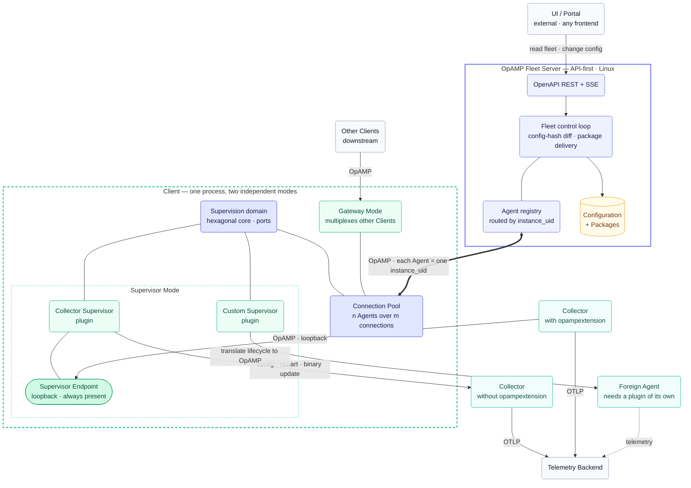

# OpAMP Fleet

[](https://github.com/mbrigl/opamp-fleet/actions/workflows/ci.yml)
[](https://github.com/mbrigl/opamp-fleet/actions/workflows/docs-check.yml)

**OpAMP Fleet** is a Rust implementation of OpenTelemetry [OpAMP](https://opentelemetry.io/docs/specs/opamp/)-based
fleet management: an API-first **Server** that manages a fleet over the protocol and exposes an
OpenAPI-described REST API for any UI or portal, and a **Client** that supervises many managed
processes at once — OpenTelemetry Collectors and, through plugins, foreign agents that do not speak
OpAMP — and that can equally run as a **gateway** multiplexing other clients upstream. The work is driven by a written
**specification** ([`docs/SPECIFICATION.md`](docs/SPECIFICATION.md)) and **Architecture Decision
Records** ([`docs/adr/`](docs/adr/)), so intent and the reasoning behind every structural choice stay
explicit and reviewable. How much of the protocol each end implements is tracked in
[`docs/CONFORMANCE.md`](docs/CONFORMANCE.md); candidate measures for hardening the Client–Server
link further are collected — as a backlog, not as decisions — in
[`docs/HARDENING.md`](docs/HARDENING.md).

> **📖 Running it? Read the [User Manual](docs/manual/README.md)** — what each end can do, how to
> start it, and every configuration key, split into [Server](docs/manual/server.md) and
> [Client](docs/manual/client.md).

> For agent instructions, see [`AGENTS.md`](AGENTS.md) — the single source of truth for all coding agents.

## Overview

A telemetry fleet is a heap of agents on a heap of machines, each configured by a local file. That
works for one agent and breaks down for a fleet: changing what a hundred agents do means reaching a
hundred machines, and nobody can say with certainty what each one is *actually* running. Configuration
drifts, rollouts are ad-hoc, and a bad configuration shows up as missing telemetry rather than as a
report.

[OpAMP](https://opentelemetry.io/docs/specs/opamp/) — the Open Agent Management Protocol — closes that
loop: an agent accepts configuration over the protocol and reports back what it applied and how it is
doing. **OpAMP Fleet** is a Rust implementation of both ends, built for a *heterogeneous* fleet —
OpenTelemetry Collectors **and** agents that were never built to speak OpAMP:

- **Server** — an API-first control plane (Linux). It holds the configuration the fleet should run,
  tracks what each agent reports back, and only reconfigures an agent whose configuration actually
  differs. Its contract is an **OpenAPI-described REST API**, so any UI or portal can read the fleet's
  state and change what it runs; the Server ships only a rudimentary UI of its own and is built to be
  integrated into an existing portal.
- **Client** — one process, installed as a native operating-system service on Linux, macOS, and
  Windows and able to update its own binary in place. It has two **modes**, independent of each other
  and combinable on the same host: **Supervisor Mode** runs **many supervisors at once**, each
  managing one process, applying the configuration it is sent and reporting health and effective
  configuration back; **Gateway Mode** accepts other clients' OpAMP connections and folds them onto a
  small pool of upstream ones, so a fleet can grow past one connection per agent. Every supervisor
  also exposes a **Supervisor Endpoint** on loopback — not a mode of its own, but part of what a
  supervisor is — because the Collector's `opampextension` is a *client only* and needs something to
  connect to; a Collector carrying it reports through that endpoint instead of being watched from
  outside. A Collector supervisor manages a Collector natively; a
  **custom supervisor** manages a **foreign agent** — an agent of a kind the project does not already
  know, needing a plugin written for it — by translating its lifecycle into the protocol.
- **Plugins over a hexagonal core** — supervisors are plugins behind stable ports. Bringing a new kind
  of process under management means writing a plugin, not changing the core, so the same control loop
  reaches agents OpAMP was never designed for.
- **The protocol, in full and on the record** — both ends implement OpAMP as completely as the
  protocol allows, against a pinned upstream version, with every capability's status and maturity
  written down in [`docs/CONFORMANCE.md`](docs/CONFORMANCE.md) rather than left to be discovered.

The goal is one place — reachable by any UI — to decide what every agent in the fleet runs and to see
what each one is really running, whether or not it speaks OpAMP. The full problem statement, goals,
vocabulary, and non-goals live in the **specification** ([`docs/SPECIFICATION.md`](docs/SPECIFICATION.md));
the reasoning behind each structural choice lives in the ADRs ([`docs/adr/`](docs/adr/)).

## Architecture

The picture keeps the shape of the [OpAMP reference architecture](https://opentelemetry.io/docs/specs/opamp/)
— a supervisor owning a Collector, exchanging OpAMP with a backend — and extends it with what makes
OpAMP Fleet different: an **API-first Server** whose contract is an OpenAPI REST API, a single
**Client** whose two modes compose freely, **Supervisors as plugins** behind a hexagonal core — each
exposing a **Supervisor Endpoint** for a Collector that speaks the protocol itself — a **Custom
Supervisor** that brings a **non-OpAMP Foreign Agent** into the same control loop, and a
**Connection Pool** that carries many Agents over few connections.


```mermaid
flowchart TB
  UI("UI / Portal<br/>external · any frontend"):::ext
  TB("Telemetry Backend"):::ext

  subgraph SRV["OpAMP Fleet Server — API-first · Linux"]
    direction TB
    API("OpenAPI REST + SSE"):::server
    LOOP("Fleet control loop<br/>config-hash diff · package delivery"):::server
    ROUTE("Agent registry<br/>routed by instance_uid"):::server
    STORE[("Configuration<br/>+ Packages")]:::store
    API --> LOOP --> STORE
    LOOP --- ROUTE
  end

  UI -->|"read fleet · change config"| API

  subgraph HOST["Client — one process, two independent modes"]
    direction TB
    CORE("Supervision domain<br/>hexagonal core · ports"):::core
    POOL("Connection Pool<br/>n Agents over m connections"):::core

    subgraph SUP["Supervisor Mode"]
      direction TB
      CS("Collector Supervisor<br/>plugin"):::host
      XS("Custom Supervisor<br/>plugin"):::host
      LS(["Supervisor Endpoint<br/>loopback · always present"]):::local
      CS --- LS
    end

    GW("Gateway Mode<br/>multiplexes other Clients"):::host

    CORE --- CS
    CORE --- XS
    CORE --- POOL
    GW --- POOL
  end

  ROUTE <==>|"OpAMP · each Agent = one instance_uid"| POOL

  COL("Collector<br/>without opampextension"):::agent
  COLX("Collector<br/>with opampextension"):::agent
  FA("Foreign Agent<br/>needs a plugin of its own"):::agent
  RC("Other Clients<br/>downstream"):::ext

  CS -->|"config · restart · binary update"| COL
  XS -->|"translate lifecycle to OpAMP"| FA
  COLX -->|"OpAMP · loopback"| LS
  RC -->|"OpAMP"| GW

  COL -->|OTLP| TB
  COLX -->|OTLP| TB
  FA -.->|telemetry| TB

  classDef server fill:#eef2ff,stroke:#6366f1,stroke-width:1px,color:#1e1b4b;
  classDef core fill:#e0e7ff,stroke:#4f46e5,stroke-width:1px,color:#1e1b4b;
  classDef host fill:#ecfdf5,stroke:#10b981,stroke-width:1px,color:#064e3b;
  classDef agent fill:#f0fdfa,stroke:#14b8a6,stroke-width:1px,color:#134e4a;
  classDef ext fill:#f8fafc,stroke:#94a3b8,stroke-width:1px,color:#0f172a;
  classDef store fill:#fffbeb,stroke:#f59e0b,stroke-width:1px,color:#78350f;
  classDef local fill:#d1fae5,stroke:#059669,stroke-width:1px,color:#064e3b;

  style SRV fill:transparent,stroke:#6366f1,stroke-width:2px;
  style HOST fill:transparent,stroke:#10b981,stroke-width:2px,stroke-dasharray:6 4;
  style SUP fill:transparent,stroke:#34d399,stroke-width:1px,stroke-dasharray:3 3;
```

On the wire the Server sees only **Agents**, told apart by `instance_uid` and never by the connection
that carried them — so whether an Agent is a Collector Supervisor, a Custom Supervisor fronting a
Foreign Agent, a Collector reporting through its own `opampextension`, or a Client several hops away
behind a Gateway is invisible to it. The Supervisor Endpoint is bound to loopback and comes up with
every supervisor; a Foreign Agent speaks no OpAMP, so nothing connects to it there and that is the
whole of the handling. What separates a Collector from a Foreign Agent is which plugin has to exist
for it, not whether it speaks OpAMP: one Collector supervisor serves every Collector, with or without
the extension, while each kind of foreign agent needs a custom supervisor written for it. Adding a
new kind of managed process means writing another plugin against the
same ports — the core does not change. The terms used here (Server, Client, Agent, Client Modes,
Supervisor Endpoint, Connection Pool, Collector/Custom Supervisor, Foreign Agent, Plugin, Port,
Selector, Package, …) are defined in [`docs/SPECIFICATION.md`](docs/SPECIFICATION.md).

## Prerequisites

- [VS Code](https://code.visualstudio.com/) with the
  [Dev Containers](https://marketplace.visualstudio.com/items?itemName=ms-vscode-remote.remote-containers)
  extension — or any DevContainer-compatible IDE
- Docker / Podman (rootless) available on the host

## Getting Started

1. Open the repository in VS Code and choose **Reopen in Container** — the Dev Container and
   preconfigured agent extensions build automatically.
2. Authenticate your coding agent inside the container (for Claude Code: `claude login`).
3. Start working with the agent — drive the work from the specification and the ADRs.

## Build, Test & Run

The toolchain is **Rust stable**, provided by the Dev Container; the code is one Cargo workspace 
with four crates — `opamp` (shared library), `server`, `client` (the Client, in all its modes), and
`package-tools` (the operator command-line tools, ADR-0065). 
This section is the single source for build/test/run commands — both humans and agents rely on 
it (AGENTS.md links here).

- **Build:** `cargo build --workspace`
- **Test:** `cargo test --workspace`
- **Lint:** `cargo fmt --all --check && cargo clippy --workspace --all-targets -- -D warnings`
- **Check the Windows build:**
  `cargo xwin clippy -p client --all-targets --target x86_64-pc-windows-msvc -- -D warnings`
  (needs `cargo install cargo-xwin` and `rustup target add x86_64-pc-windows-msvc`; the Dev
  Container carries the `llvm-lib` it requires). Worth running whenever a change touches
  platform-gated code or the tests around it: CI builds the Client on Windows and macOS, and a
  `#[cfg(unix)]` mistake compiles perfectly well on Linux.
- **Audit dependencies:** `cargo audit` (needs `cargo install cargo-audit`; reviewed, non-actionable
  advisories are recorded in [`.cargo/audit.toml`](.cargo/audit.toml))
- **Run the Server:** `cargo run -p server -- --config config/server.toml`
- **Run the Client:** `cargo run -p client -- --config config/supervisor.toml`
- **Run an operator tool:** `cargo run --bin opamp-package-fetch` (fetch a known agent's release
  and hand it to the Server) or `cargo run --bin opamp-package-sign -- --help` (build, hash, and
  sign an artifact out of any program) — both documented in
  [the manual](docs/manual/tools.md); an installed release ships them beside the Client.

Both binaries read a TOML configuration file ([ADR-0008](docs/adr/0008-toml-configuration.md));
every setting has a default, so they also start with no file at all. The annotated examples live in
[`config/`](config/). CI ([`.github/workflows/ci.yml`](.github/workflows/ci.yml)) runs exactly these
build/test/lint commands and additionally release-builds the Client for Linux, Windows, and macOS
and the Server for Linux.

**Releases** ([ADR-0025](docs/adr/0025-release-pipeline-and-artifacts.md),
[ADR-0026](docs/adr/0026-version-from-cargo-toml.md)): the version is
`[workspace.package] version` in [`Cargo.toml`](Cargo.toml), and the `Release` workflow makes the
`version/*` tag from it before it builds — so bumping the version is an ordinary reviewed commit and
nobody types a tag. Running it publishes one archive per platform,
`supervisor_<version>_<os>_<arch>.tar.gz` for Linux, macOS and Windows on the architectures each
ships on, plus a `SHA256SUMS` file. The files are named after the **Set** an operator uploads them
to, not after the product inside them
([ADR-0078](docs/adr/0078-a-release-is-named-after-the-set-it-becomes.md)) — and since
[ADR-0080](docs/adr/0080-the-program-and-its-configuration-are-named-supervisor.md) the program
inside them, its service and its configuration file are called `supervisor` too. Only the
dpkg/rpm/MSI package identity stays `opamp-fleet-client`, so an `apt`, `dnf` or MSI upgrade stays
an upgrade. The fields are separated by `_` because a name and a version both
contain `-` ([ADR-0032](docs/adr/0032-release-artifacts-separate-their-fields-with-underscores.md)),
and the last two are exactly what an Agent reports as `os.type` and `host.arch` (`linux_amd64`,
`darwin_arm64`, …), so uploading a whole release under one package
name needs no translation ([ADR-0031](docs/adr/0031-per-platform-package-variants.md)). Started with `dry_run` (the default) it builds and packs everything and
publishes nothing. Before it builds anything at all it checks that the version is still free — a
`version/*` tag or a release already carrying that number fails the run on the spot, dry or not, so a
forgotten bump costs seconds rather than five build jobs — and the built binary must report the
version the artifacts are named after. Each archive is also a
ready package artifact: the same file an operator downloads is the one a fleet is handed for a Client
[self-update](docs/manual/client.md#updating-the-client-itself).

## Usage

This section is a tour. The complete operator reference — every option and every configuration key
of both ends — is the **[User Manual](docs/manual/README.md)**:
[Server](docs/manual/server.md) · [Client](docs/manual/client.md) ·
[Command-line tools](docs/manual/tools.md).

A minimal closed control loop on one machine:

1. **Start the Server:** `cargo run -p server -- --config config/server.toml` — it serves two
   planes on two ports ([ADR-0066](docs/adr/0066-the-agent-plane-and-the-operator-plane-get-their-own-listeners.md)).
   The **Agent plane** on `4320`: the OpAMP endpoint at `/v1/opamp` (plain HTTP **and** WebSocket,
   [ADR-0007](docs/adr/0007-dual-transport-and-tls.md)) and the package downloads the offers point
   at. The **Operator plane** on `127.0.0.1:4321`: the REST API under `/api/v1/`
   ([ADR-0012](docs/adr/0012-selector-targeted-configurations-and-openapi-rest-api.md)), the API
   docs, and the bundled UI at `/` — on loopback, because it is open until `[rest.auth]` guards it
   with Basic credentials
   ([ADR-0067](docs/adr/0067-basic-authentication-on-the-operator-plane.md)).
2. **Start a Client:** `cargo run -p client -- --config config/supervisor.toml` — it connects over
   WebSocket by default (`ws://127.0.0.1:4320/v1/opamp`), reports its description and health, and
   appears in the fleet. Point `endpoint` at an `http(s)://` URL to use the polling transport
   instead.
3. **Open the UI** at <http://127.0.0.1:4321/> — the Agent is listed as *Connected*. Press
   **Configurations**, name a Configuration, optionally give it a Selector (`key=value` pairs an
   Agent's reported attributes must equal; empty targets every Agent), enter the configuration
   text, and save.
4. **Watch the loop close:** a WebSocket Client whose attributes match receives the configuration
   within a second, an HTTP Client on its next poll. The Agent stores it (under its `state_dir`),
   reports it **Applied** with the matching hash, and its effective configuration shows up in the
   table. Distributing the same configuration again sends nothing — the config-hash comparison
   gates every push. An Agent matching several Configurations receives all of them as named
   entries and merges them itself; an Agent matching none is left running what it already runs.

The same operations are available to any portal through the REST API — the OpenAPI document at
`/api/v1/openapi.json` is the contract to generate a client from:

```console
$ curl http://127.0.0.1:4321/api/v1/agents                   # the fleet, with reported attributes
$ curl http://127.0.0.1:4321/api/v1/configurations           # every Configuration
$ curl -X PUT -H 'Content-Type: application/json' \
       -d '{"selector": {"os.type": "linux"}, "body": "receivers: {}"}' \
       http://127.0.0.1:4321/api/v1/configurations/linux-base  # distribute to a subset
$ curl -X DELETE http://127.0.0.1:4321/api/v1/configurations/linux-base

# Content the agent reads by path rather than is configured with (ADR-0016): written next to the
# configuration under its own name, never passed to the process as configuration.
$ curl -X PUT -H 'Content-Type: application/json' \
       -d '{"body": "rules: []", "role": "supplementary"}' \
       http://127.0.0.1:4321/api/v1/configurations/ruleset

# A package defines a Set (ADR-0052), identified by name, Agent type, and version, with one entry
# per platform (ADR-0031); each Agent is offered the entry that fits it. Saving stages a draft —
# nothing reaches the fleet until the Set is published (ADR-0043).
$ curl -X PUT -H 'Content-Type: application/json' -d '{}' \
       http://127.0.0.1:4321/api/v1/packages/otelcol/otelcol-contrib/0.109.0
$ curl -X PUT --data-binary @otelcol-linux-amd64.tar.gz \
       http://127.0.0.1:4321/api/v1/packages/otelcol/otelcol-contrib/0.109.0/entries/linux/amd64
$ curl -X PUT -H 'Content-Type: application/json' -d '{"published": true}' \
       http://127.0.0.1:4321/api/v1/packages/otelcol/otelcol-contrib/0.109.0/publication

# Rolling back is a publication move (ADR-0052): retract the newest version, and the fleet falls
# back to the newest one still published under the same name.
$ curl -X PUT -H 'Content-Type: application/json' -d '{"published": false}' \
       http://127.0.0.1:4321/api/v1/packages/otelcol/otelcol-contrib/0.109.0/publication
```

For TLS, give the Server a certificate (`[tls]` in `server.toml`) and the Client a `wss://` or
`https://` endpoint — plus `ca_file` under `[tls]` when the certificate comes from a private CA.

### Running as an OS service

The Client registers *itself* as a native service on Linux (systemd), macOS (launchd), and Windows
(SCM) — [ADR-0010](docs/adr/0010-client-os-service-and-cli.md):

```console
$ supervisor service install --config /etc/opamp/supervisor.toml     # system service (root/Administrator)
$ supervisor service start
$ supervisor service status
$ supervisor service stop
$ supervisor service uninstall                                   # never deletes layout or state
```

- **Instances:** every flag accepts `--instance <name>` (default `default`); each instance is an
  independent service (`supervisor-<name>`) with its own configuration, install root,
  and state — several differently-configured Clients coexist on one host.
- **Install root:** `--root <dir>` puts everything under one directory; nothing is ever installed
  to a fixed path. Without it, a Linux system install splits the defaults: the executable layout —
  `versions/supervisor-<version>-<commit>/` and the `current` pointer the service runs
  from — lives at `/opt/opamp-fleet/client/<instance>`, while `supervisor.toml` and the default
  `state/` directory stay at `/var/lib/opamp-fleet/client/<instance>` (SELinux never lets systemd
  execute a binary under `/var/lib` —
  [ADR-0053](docs/adr/0053-the-linux-service-executes-from-opt.md)). macOS, Windows, and user
  scope keep one default directory for everything.
- **Scope:** `--user` targets the user-level manager (development); the default is a system
  service that starts at boot.
- Stopping the service sends the OpAMP `agent_disconnect` goodbye (`SIGTERM` on Unix, an SCM stop
  control on Windows); after a crash the manager restarts the service, after an explicit stop it
  stays down.
- **Self-update** ([ADR-0020](docs/adr/0020-client-self-update.md)): the Client is always its own
  Agent, so the Server can see which version each host runs. Letting the Server *replace* that
  version is opt-in per Client and names the package it will take — anything else is refused,
  because a package aimed at the whole fleet would otherwise be written over the Client itself:

  ```toml
  [self_update]
  package = "supervisor"           # only this package is ever installed over this binary
  ```

  A new version is staged beside the running one under `versions/`, run once to prove it is this
  program at the version offered, and switched to by moving `current`. The Client then exits and
  the service manager starts the new version; one that does not reach the Server within a few
  restarts is rolled back to its predecessor, and either outcome is reported to the Server by
  whichever version came up.

The **`Service smoke` workflow** exercises the real thing on an ephemeral runner — install, start,
the Agent appearing in the fleet, its process killed and brought back by the manager, an explicit
stop that stays stopped, uninstall. It runs nightly and on demand rather than per push (it installs
a system service and waits on timers), currently on Windows, where the restart is the Client's own
doing and nothing else asserts it. The test is `crates/client/tests/service_smoke.rs`; it is
`#[ignore]`d, so an ordinary `cargo test` never installs anything.

What still needs a human, per platform: starting at **boot** (a runner never reboots), the logs
(`journalctl -u supervisor` on Linux, Console/`log show` on macOS), the Agent in
the fleet UI, a second `--instance` beside the first, and an **SELinux-enforcing host** (Fedora,
RHEL, or SUSE 16 with `getenforce` answering `Enforcing`): the `.rpm` install must start —
a service dying with `status=203/EXEC` and an AVC denial in `ausearch -m avc` is the failure
ADR-0053 exists to prevent. Known platform gaps (tracked in the ADR):
launchd `status` is advisory and `install` does not auto-start there. The SCM still discards a
Windows service's stderr, but the service now writes its own rotating log under
`<state_dir>/logs` on every platform (ADR-0041), which is where to look when the manager shows a
service that will not start.

## Project Layout

```
README.md             # overview & setup for humans
CHANGELOG.md          # operator-facing changes: what an upgrade needs edited or moved
AGENTS.md             # single source of truth for coding agents
docs/manual/         # the user manual: Server, Client, and the operator tools, option by option
docs/SPECIFICATION.md # the specification: problem, goals, vocabulary
docs/CONFORMANCE.md   # OpAMP Protocol Baseline + capability conformance matrix
docs/HARDENING.md     # candidate hardening measures for the Client-Server link (a backlog, not decisions)
docs/adr/             # Architecture Decision Records (+ template)
crates/               # Cargo workspace: opamp (shared) · server · client · package-tools (operator CLIs)
config/               # annotated example configuration files (server.toml, supervisor.toml)
scripts/check-docs.sh # documentation & protocol-baseline consistency checks
rust-toolchain.toml   # pinned Rust toolchain (stable + rustfmt + clippy)
.devcontainer/        # Dev Container definition (base image + Features)
.vscode/              # shared editor settings
.claude/CLAUDE.md     # pointer for Claude Code to read AGENTS.md
.claude/settings.json # Claude Code permissions: prompt before git/gh writes
```

## Dev Container

The environment is defined entirely in [`.devcontainer/devcontainer.json`](.devcontainer/devcontainer.json):
it starts from a prebuilt base image and layers Dev Container Features and VS Code extensions on top —
no Dockerfile or Compose file required. Customise the environment by adding Features, switching the
base image, or adding extensions.

### Host container management

The Dev Container deliberately has **no access to the host Docker daemon** — the socket is not mounted
([ADR-0002](docs/adr/0002-dev-container-runtime.md)). To manage the host's containers from VS
Code, run the **Container Tools** extension (`ms-azuretools.vscode-containers`) on the **host** side:
install it in your host VS Code. [`.vscode/settings.json`](.vscode/settings.json) already pins it to
run locally via `remote.extensionKind`, so it keeps talking to the host engine even when this folder
is reopened in the container.

## Coding Agents

This Dev Container preinstalls the **Claude Code** and **Mistral Vibe** VS Code extensions (see
[`.devcontainer/devcontainer.json`](.devcontainer/devcontainer.json)); other agents (OpenAI Codex,
Cursor, OpenCode, GitHub Copilot) work too once you add them. Authenticate your agent inside the
container (for Claude Code: `claude login`).

The rules every agent follows live in [`AGENTS.md`](AGENTS.md); how each agent is wired to read them
is recorded in [ADR-0001](docs/adr/0001-agent-governance-model.md).

## Contributing

See [`CONTRIBUTING.md`](CONTRIBUTING.md) for the workflow (specification- and ADR-driven, small
reviewable changes) and [`CODE_OF_CONDUCT.md`](CODE_OF_CONDUCT.md) for the community standards we
expect of everyone taking part. Security issues: please follow [`SECURITY.md`](SECURITY.md) instead
of opening a public issue.

## License

Released under the Apache License 2.0 — see [`LICENSE`](LICENSE) and [`NOTICE`](NOTICE).
